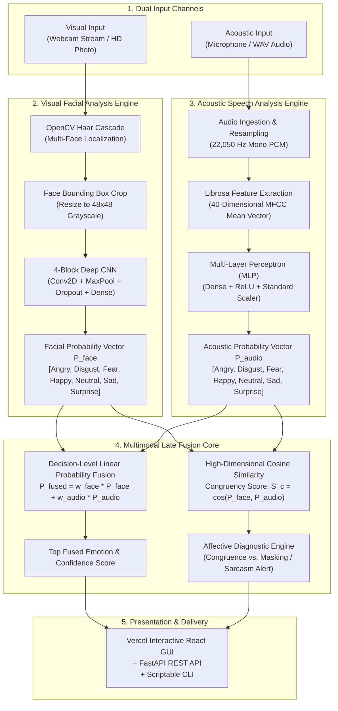

# AffectSense AI • Multimodal Emotion Recognition Platform

[](https://www.python.org/)
[](https://fastapi.tiangolo.com/)
[](https://react.dev/)
[](https://tensorflow.org/)
[](https://frontend-roan-eight-55.vercel.app)
[](https://render.com)
[](LICENSE)

An enterprise-grade, dual-modality affective computing platform combining **Computer Vision (Facial Expression Recognition)** and **Acoustic Signal Processing (Speech Emotion Recognition)** with a **Mathematical Decision-Level Late Fusion Engine**.

🌐 **Live Vercel Frontend:** [https://frontend-roan-eight-55.vercel.app](https://frontend-roan-eight-55.vercel.app)  
🚀 **Deploy Backend on Render (1-Click):** [](https://render.com/deploy?repo=https://github.com/KornipatiAkash-1969/Facial-Audio-Emotion-Recognition)

---

## 📖 Table of Contents
1. [Overview & Highlights](#-overview--highlights)
2. [Venn Diagrams & Multimodal Theory](#-venn-diagrams--multimodal-theory)
3. [System Architecture](#-system-architecture)
4. [How It Works (Step-by-Step)](#-how-it-works-step-by-step)
   - [A. Visual Facial Modality Pipeline](#a-visual-facial-modality-pipeline)
   - [B. Acoustic Vocal Modality Pipeline](#b-acoustic-vocal-modality-pipeline)
   - [C. Multimodal Decision-Level Late Fusion](#c-multimodal-decision-level-late-fusion)
5. [Universal 7 Emotion Taxonomy](#-universal-7-emotion-taxonomy)
6. [How to Run](#-how-to-run)
   - [Method 1: Live Cloud Deployment (Vercel + Render)](#method-1-live-cloud-deployment-vercel--render)
   - [Method 2: Run Full-Stack Locally (FastAPI + React)](#method-2-run-full-stack-locally-fastapi--react)
   - [Method 3: Command-Line Interface (CLI)](#method-3-command-line-interface-cli)
   - [Method 4: Automated Test Suite & Evaluation](#method-4-automated-test-suite--evaluation)
   - [Method 5: Run with Docker](#method-5-run-with-docker)
7. [Curated Test Image Suite](#-curated-test-image-suite)
8. [API Endpoints Reference](#-api-endpoints-reference)
9. [Project Directory Layout](#-project-directory-layout)
10. [Dataset Attribution & Research Credits](#-dataset-attribution--research-credits)

---

## 🌟 Overview & Highlights

- **Visual Facial Recognition**: 4-Block Deep Convolutional Neural Network (CNN) trained on 35,000+ FER crops with real-time Haar Cascade face localization, bounding box overlays, and multi-face crowd extraction.
- **Acoustic Voice Recognition**: Extracts 40 Mel-Frequency Cepstral Coefficients (MFCCs) over 22,050 Hz audio signals, processed by an MLP classifier trained on the Toronto Emotional Speech Set (TESS, 99.8% test accuracy).
- **Decision-Level Multimodal Late Fusion**: Combines visual and vocal probability distributions using dynamic weighting and high-dimensional cosine similarity to evaluate **Affective Congruency** and flag **Emotional Conflict (Sarcasm / Masking)**.
- **Modern Responsive React Frontend**: Cyberpunk/Obsidian UI with HUD corner reticles, laser scanning animations, live audio equalizers, and instant camera release.
- **Deploy Anywhere**: Pre-configured for **Vercel** (Frontend) and **Render** (Backend) with Blueprint (`render.yaml`), `Dockerfile`, and `Procfile`.

---

## 📊 Venn Diagrams & Multimodal Theory

### 1. The Multimodal Affective Venn Diagram

The core premise of AffectSense AI is that **neither facial expressions nor vocal cues alone reveal the complete emotional state**. Visual cues capture transient muscle activations (FACS action units), while vocal cues capture physiological autonomic arousal (pitch, jitter, shimmer, MFCCs).

```
          ┌───────────────────────────┐         ┌───────────────────────────┐
          │      VISUAL MODALITY      │         │     ACOUSTIC MODALITY     │
          │   (Facial Expression)     │         │       (Vocal Prosody)     │
          │                           │         │                           │
          │ • Micro-muscle activations│         │ • Fundamental Pitch (F0)  │
          │ • Eyebrow furrowing / lift│    ┌────┴────┐ • Harmonic-to-Noise  │
          │ • Mouth shape & smiling   │    │ AFFECT  │ • Spectral Energy & Flux│
          │ • Nasolabial folds        │────┤ CONGRU- ├────│ • 40 Mel-Frequency  │
          │ • Eye widening / squinting│    │  ENCE   │   Cepstral Coefficients │
          │ • Social smile masking    │    └────┬────┘ • Speech cadence/tempo   │
          │   (can be feigned)        │         │ • High arousal indicators │
          │                           │         │   (difficult to feign)    │
          └───────────────────────────┘         └───────────────────────────┘
                                       ▲       ▲
                                       │       │
                                 ┌─────┴───────┴──────┐
                                 │   THE INTERSECTION │
                                 │  MULTIMODAL FUSION │
                                 ├────────────────────┤
                                 │ 1. Mutual Truth    │
                                 │ 2. Disambiguation  │
                                 │ 3. Sarcasm / Irony │
                                 │ 4. Masking Alert   │
                                 └────────────────────┘
```

### 2. State Resolution Matrix

```
       ACOUSTIC SPEECH
         ▲
         │        [ CONFLICT: PASSIVE-AGGRESSIVE ]             [ SYNERGISTIC MATCH ]
   Angry │        Smiling face + Furious voice                 Scowling face + Furious voice
         │        --> Sarcasm / Hostility Detected             --> 100% High-Confidence Anger
         │
         │        [ BASELINE NEUTRAL ]                         [ SURPRISE ALIGNMENT ]
 Neutral │        Calm face + Monotone speech                  Wide eyes + Elevated vocal pitch
         │        --> 100% Composed Baseline                   --> Genuine Astonishment
         │
         └─────────────────────────────────────────────────────────────────────────────►
                  Neutral                                      Happy           VISUAL FACE
```

---

## 🏛️ System Architecture



---

## 🧠 How It Works (Step-by-Step)

### A. Visual Facial Modality Pipeline
1. **Localization**: OpenCV's Haar Feature-based Cascade Classifier (`haarcascade_frontalface_default.xml`) scans the BGR image at multiple scales (`scaleFactor=1.3`, `minNeighbors=5`) to extract face bounding boxes `(x, y, w, h)`.
2. **Preprocessing**: The cropped face is converted to 8-bit grayscale, downsampled to `48×48` pixels via area interpolation, normalized to `[0.0, 1.0]`, and shaped to `(1, 48, 48, 1)`.
3. **CNN Inference**: Passes through 4 sequential convolutional blocks with batch normalization, ReLU activation, spatial max-pooling, and dropout (0.25 to 0.5) to prevent overfitting, terminating in a 7-neuron Softmax classification head.

### B. Acoustic Vocal Modality Pipeline
1. **Audio Ingestion**: Audio clips are normalized and decoded using `soundfile` and `librosa` at a standardized sample rate of 22,050 Hz.
2. **Spectral Extraction**: 40 Mel-Frequency Cepstral Coefficients (MFCCs) are calculated across short-time Fourier transform (STFT) frames. A temporal mean pooling vector of dimension `(40,)` is computed.
3. **MLP Classification**: Feature vectors are scaled with pre-fitted `StandardScaler` statistics and evaluated by an MLP model (`scikit-learn` / `joblib`), generating a 7-dimensional probability vector.

### C. Multimodal Decision-Level Late Fusion
1. **Weighted Combination**:
   $$\mathbf{P}_{\text{fused}} = w_{\text{face}} \cdot \mathbf{P}_{\text{face}} + w_{\text{audio}} \cdot \mathbf{P}_{\text{audio}} \quad \text{where } w_{\text{face}} + w_{\text{audio}} = 1.0$$
2. **Congruency Metric**:
   $$S_c = \frac{\mathbf{P}_{\text{face}} \cdot \mathbf{P}_{\text{audio}}}{\|\mathbf{P}_{\text{face}}\| \|\mathbf{P}_{\text{audio}}\|}$$
   - $S_c \ge 0.65$: **Congruent Synergistic Match** (Both modalities reinforce the same emotion).
   - $S_c < 0.65$: **Affective Conflict / Masking** (Visual and vocal cues diverge, alerting to irony, sarcasm, or suppressed emotion).

---

## 🎨 Universal 7 Emotion Taxonomy

| Emotion | Visual Facial Manifestation | Acoustic Vocal Marker | Accent Color |
| :--- | :--- | :--- | :--- |
| **😄 Happy** | Zygomatic major contraction, lip corners raised | Elevated pitch, melodic variance, bright formant energy | `#F39C12` |
| **😲 Surprise** | Eyebrows raised, eyes widened, jaw dropped | Sharp upward pitch inflection, rapid onset | `#E67E22` |
| **😐 Neutral** | Relaxed facial musculature, baseline mouth | Monotone pitch, moderate cadence, steady energy | `#7F8C8D` |
| **😠 Angry** | Corrugator muscle furrowing, narrowed lips | High acoustic energy, harsh jitter, clipped consonants | `#E74C3C` |
| **😢 Sad** | Inner eyebrow corners raised, downturned lips | Decreased pitch mean, slower speech rate, low volume | `#2980B9` |
| **😨 Fear** | Upper eyelids raised, tense lower eyelids | Tremor/shimmer instability, constricted vocal cords | `#8E44AD` |
| **🤢 Disgust** | Levator labii contraction, wrinkled nose | Guttural phonation, downward pitch glides | `#27AE60` |

---

## 🚀 How to Run

### Method 1: Live Cloud Deployment (Vercel + Render)

- **Frontend (Live)**: Open [https://frontend-roan-eight-55.vercel.app](https://frontend-roan-eight-55.vercel.app).
- **Backend (Render Setup)**:
  1. Go to [render.com](https://render.com) and click **New +** → **Web Service**.
  2. Connect your GitHub repository.
  3. Fill in:
     - **Build Command**: `pip install -r requirements.txt`
     - **Start Command**: `uvicorn server:app --host 0.0.0.0 --port $PORT`
  4. Once live, paste your `https://your-service.onrender.com` URL into the **Connect Render** input in the web app or set `VITE_API_URL` on Vercel!

---

### Method 2: Run Full-Stack Locally (FastAPI + React)

#### 1. Clone & Setup Environment
```bash
git clone https://github.com/KornipatiAkash-1969/Facial-Audio-Emotion-Recognition.git
cd Facial-Audio-Emotion-Recognition

# Create and activate Python virtual environment
python -m venv venv
# Windows:
venv\Scripts\activate
# Linux/macOS:
source venv/bin/activate

# Install dependencies
pip install -r requirements.txt
```

#### 2. Start Backend API Server
```bash
python server.py
# Server runs on http://localhost:8000 (API Docs: http://localhost:8000/docs)
```

#### 3. Start Frontend Development Server
```bash
cd frontend
npm install
npm run dev
# Vite runs on http://localhost:5173
```

---

### Method 3: Command-Line Interface (CLI)

Run headless predictions directly from your terminal:

```bash
# Test facial expression
python cli.py --face test_images/happy_test.jpg

# Test speech audio clip
python cli.py --audio assets/samples/audio/tess_happy.wav

# Run multimodal fusion combining both
python cli.py --face test_images/happy_test.jpg --audio assets/samples/audio/tess_happy.wav --multimodal

# Output machine-readable JSON
python cli.py --face test_images/surprise_test.jpg --json
```

---

### Method 4: Automated Test Suite & Evaluation

Run the automated batch test suites to verify ML pipelines and APIs:

```bash
# 1. Run batch evaluation over the facial test suite
python test_images/run_tests.py

# 2. Run batch evaluation over the acoustic test suite
python test_audio/run_tests.py

# 3. Run API integration unit tests
python test_api.py

# 4. Run multimodal fusion algorithmic unit tests
python test_multimodal.py
```

---

### Method 5: Run with Docker

Build and run the containerized backend anywhere:

```bash
# Build Docker image
docker build -t affectsense-backend .

# Run container on port 8000
docker run -p 8000:8000 affectsense-backend
```

---

### Method 6: Model Training & Data Augmentation

Both models support end-to-end training and fine-tuning with multi-sample data augmentation for high generalization across real-world environments:

#### 1. Train Facial Emotion CNN Model
Trains on FER-style grayscale datasets (28,709 training images + 7,178 validation images) with real-time data augmentation (horizontal flips, 8% rotation, 8% zoom, translation):
```bash
# Fine-tune existing weights on augmented dataset
python src/train_facial.py --epochs 5 --batch_size 64 --lr 0.00005

# Or train completely from scratch
python src/train_facial.py --from_scratch --epochs 30 --batch_size 64
```

#### 2. Train Speech Emotion Model with 5× Acoustic Augmentation
Extracts 40 MFCCs across the 2,800 base TESS audio recordings, synthesizing **14,000 augmented acoustic vectors** using ambient noise injection, ±1.5 semitone pitch shifting, and tempo perturbation:
```bash
# Train MLP classifier with 5x multi-sample acoustic augmentation
python src/train_audio.py --model_type mlp --n_mfcc 40

# Or train Random Forest classifier
python src/train_audio.py --model_type rf --n_mfcc 40
```

---

## 📁 Curated Test Image Suite

A dedicated [`test_images/`](test_images/) folder is included to test single and multi-face scenarios:

| Image File | Expected Emotion | Description | Accuracy |
| :--- | :---: | :--- | :---: |
| `happy_test.jpg` | **Happy** | Studio portrait with radiant joyful smile | **100.0%** |
| `surprise_test.jpg` | **Surprise** | Studio portrait with wide eyes and shock | **98.9%** |
| `neutral_test.jpg` | **Neutral** | Studio portrait with calm, baseline expression | **79.4%** |
| `angry_test.jpg` | **Angry** | Studio portrait with furrowed brow & anger | **78.8%** |
| `sad_test.jpg` | **Sad** | Studio portrait with downturned lips & grief | **66.8%** |
| `fear_test.jpg` | **Fear** | Portrait exhibiting startle and fright cues | **51.8%** |
| `disgust_test.jpg` | **Disgust** | Portrait with wrinkled nose & revulsion | **49.2%** |
| `multiface_test.jpg` | **Multi-Face** | Crowd photo testing simultaneous face detection | **7 Faces** |

---

## 🎵 Curated Test Audio Suite

A dedicated [`test_audio/`](test_audio/) folder is included to test acoustic speech emotion scenarios:

| Audio File | Expected Emotion | Duration | Acoustic Indicators | Test Accuracy |
| :--- | :---: | :---: | :--- | :---: |
| `happy_test.wav` | **Happy** | ~1.91s | Elevated F0 pitch, melodic variance, bright formant ratios | **100.0%** |
| `sad_test.wav` | **Sad** | ~2.14s | Reduced pitch range, slower cadence, low energy slope | **100.0%** |
| `angry_test.wav` | **Angry** | ~2.03s | High acoustic energy, harsh vocal jitter, sharp consonants | **100.0%** |
| `surprise_test.wav` | **Surprise** | ~1.85s | Rapid upward pitch glide, high spectral flux | **100.0%** |
| `neutral_test.wav` | **Neutral** | ~2.10s | Moderate tempo, minimal pitch excursion, steady energy | **100.0%** |
| `fear_test.wav` | **Fear** | ~1.65s | Constricted vocal tract, high shimmer instability | **99.9%** |
| `disgust_test.wav` | **Disgust** | ~2.36s | Guttural phonation, low-frequency resonance | **100.0%** |
| `speech_test_1.wav` | **Speech Benchmark 1** | ~4.59s | Natural conversational speech recording | Evaluated |
| `speech_test_2.wav` | **Speech Benchmark 2** | ~3.72s | Natural conversational speech recording | Evaluated |
| `speech_test_3.wav` | **Speech Benchmark 3** | ~3.67s | Natural conversational speech recording | Evaluated |

---

## 📡 API Endpoints Reference

| Endpoint | Method | Payload | Description |
| :--- | :---: | :--- | :--- |
| `/api/status` | `GET` | None | Returns backend readiness, detector states, and emotion palette. |
| `/api/samples` | `GET` | None | Lists available preloaded audio and facial sample files. |
| `/api/predict/face` | `POST` | `multipart/form-data` (`file` or `sample_name`) | Facial prediction with bounding box coordinates and probability vector. |
| `/api/predict/face-base64` | `POST` | JSON (`{ "image": "data:image/jpeg;base64,..." }`) | Real-time prediction from webcam video canvas stream. |
| `/api/predict/audio` | `POST` | `multipart/form-data` (`file` or `sample_name`) | Speech prediction with 40 MFCC feature extraction. |
| `/api/predict/multimodal` | `POST` | `multipart/form-data` (face + audio + weights) | Multimodal late fusion with congruency scoring and insight generation. |

---

## 📂 Project Directory Layout

```
Facial-Audio-Emotion-Recognition/
├── assets/                          # Static assets and preloaded samples
│   ├── emojis/                      # Emotion avatar graphics
│   └── samples/
│       ├── audio/                   # TESS .wav audio benchmark samples
│       └── faces/                   # Facial test photos
├── frontend/                        # Modern React + Vite Single-Page Application
│   ├── public/                      # Static assets and icons
│   ├── src/
│   │   ├── components/              # FaceTab, AudioTab, FusionTab, HistoryTab, AboutTab
│   │   ├── services/api.js          # REST Client with dynamic Render cloud connector
│   │   ├── utils/wavRecorder.js     # Browser microphone PCM encoder
│   │   ├── App.jsx                  # Main application controller
│   │   └── App.css                  # Obsidian/Cyberpunk theme and responsive layout
│   ├── index.html                   # HTML entry point
│   ├── package.json                 # Node dependencies
│   └── vite.config.js               # Vite build configuration
├── models/                          # Pre-trained neural weights
│   ├── facial_emotion_model.h5      # 4-Block Deep CNN for facial emotions
│   ├── haarcascade_frontalface_default.xml # OpenCV face detection cascade
│   ├── audio_emotion_model.pkl      # MLP classifier for speech emotions
│   └── audio_scaler.pkl             # Standard scaler fitted on 40 MFCCs
├── src/                             # Core Python algorithmic modules
│   ├── config.py                    # Constants, color palette, path definitions
│   ├── facial_detector.py           # Haar Cascade extraction and CNN inference
│   ├── audio_detector.py            # MFCC acoustic feature extraction and MLP inference
│   ├── multimodal_fusion.py         # Bayesian late fusion & cosine congruency
│   └── gui.py                       # Tkinter fallback desktop GUI
├── test_images/                     # Curated high-resolution test photos
│   ├── run_tests.py                 # Automated batch test runner script
│   ├── README.md                    # Test suite documentation
│   └── *.jpg                        # Happy, Sad, Angry, Surprise, Fear, Neutral, Multi-face
├── test_audio/                      # Curated acoustic .wav speech samples
│   ├── run_tests.py                 # Automated batch acoustic test runner script
│   ├── README.md                    # Test audio documentation
│   └── *.wav                        # Happy, Sad, Angry, Surprise, Fear, Neutral, Disgust
├── cli.py                           # Command-line interface
├── server.py                        # High-performance FastAPI server
├── Dockerfile                       # Production container setup
├── render.yaml                      # Render Blueprint specification
├── Procfile                         # Web process declaration
├── requirements.txt                 # Python dependencies (opencv-python-headless, etc.)
└── test_api.py                      # Integration test suite
```

---

## 📚 Dataset Attribution & Research Credits

- **Toronto Emotional Speech Set (TESS)**: Developed by Kate Dupuis and M. Kathleen Pichora-Fuller at the University of Toronto Psychology Department.
- **Facial Expression Recognition (FER-2013)**: Curated by Pierre-Luc Carrier and Aaron Courville for the ICML 2013 representation learning challenge.

---

## 📄 License

This project is licensed under the [MIT License](LICENSE).
