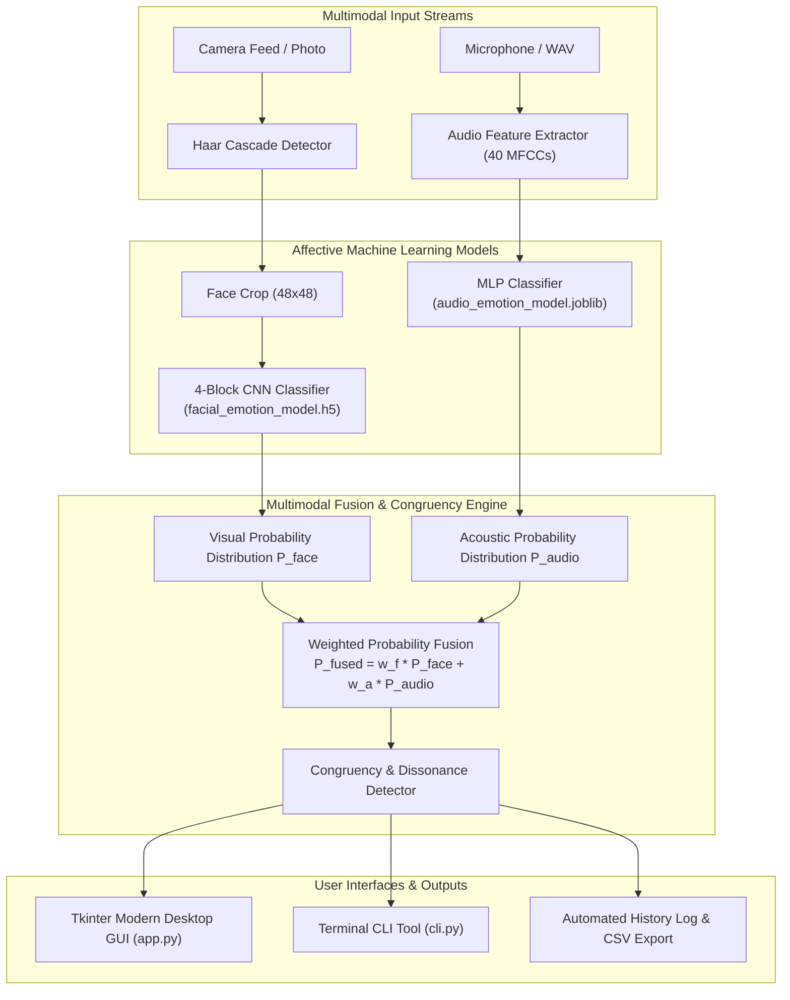

# Multimodal Emotion Recognition System

An integrated, end-to-end affective computing platform combining **Computer Vision (Facial Expression Recognition)** and **Speech Signal Processing (Audio Emotion Recognition)** with **Multimodal Decision-Level Fusion**.

This project unifies and elevates two standalone repositories into a production-grade, modular, and non-blocking desktop application and CLI tool.

---

## 🌟 Key Capabilities

1. **Facial Emotion Recognition (Visual Modality)**:
   - **Haar Cascade Face Detection**: Fast, robust localization of multiple human faces in frames.
   - **4-Block Convolutional Neural Network (CNN)**: Classifies 48x48 grayscale facial crops into universal emotion classes.
   - **Live Webcam Support**: 30 FPS non-blocking streaming directly inside the GUI with real-time emotion bounding boxes.
   - **Static Image Analysis**: Upload any photo to detect and visualize all faces with individual emotion predictions.

2. **Speech Emotion Recognition (Acoustic Modality)**:
   - **Mel-Frequency Cepstral Coefficients (MFCCs)**: 40-dimensional acoustic feature extraction capturing vocal tract resonance and prosody.
   - **Neural & Ensemble Classifiers**: Pre-trained on the Toronto Emotional Speech Set (**TESS**) achieving **99.8% test accuracy**.
   - **Audio Playback & Waveform View**: Built-in audio playback for `.wav` speech samples.
   - **Live Microphone Recording**: Capture 3-second speech snippets directly within the app.

3. **Multimodal Decision-Level Fusion & Affective Computing**:
   - **Weighted Probabilistic Integration**: Dynamically balance visual facial confidence and acoustic speech confidence.
   - **Emotional Congruency Analysis**: Detects whether non-verbal facial cues and vocal prosody align (**Synergistic Match**) or contradict (**Affective Dissonance** / Sarcasm / Social Masking).
   - **Psychological Insights Engine**: Automatic qualitative interpretation of the subject's emotional state.

4. **Prediction History & Export**:
   - Tabular tracking of all session predictions with timestamps, modalities, confidence scores, and source metadata.
   - One-click CSV export.

---

## 🏗️ Architecture



---

## 🎯 7 Universal Emotion Classes

Both modalities and the fusion engine standardize on the 7 universal emotions:

| Emotion | UI Color Code | Associated Affective Dynamics |
| :--- | :--- | :--- |
| **Angry** | `#E74C3C` (Red) | High vocal pitch/energy, furrowed brows, tense mouth |
| **Disgust** | `#27AE60` (Green) | Lower speech tempo, wrinkled nose, raised upper lip |
| **Fear** | `#8E44AD` (Purple) | Wide eyes, rapid speech cadence, high jitter |
| **Happy** | `#F39C12` (Amber) | Raised cheeks (Duchenne smile), melodious pitch variation |
| **Neutral** | `#7F8C8D` (Gray) | Baseline facial musculature, steady fundamental frequency |
| **Sad** | `#2980B9` (Blue) | Downward mouth corners, reduced vocal intensity and speech rate |
| **Surprise** | `#E67E22` (Orange) | Widened eyes, dropped jaw, sharp acoustic rise |

---

## 📁 Project Directory Structure

```
Multimodal-Emotion-Recognition/
├── app.py                     # Primary GUI application launcher
├── cli.py                     # Command-line interface for scripting/headless evaluation
├── requirements.txt           # Verified Python package dependencies
├── test_multimodal.py         # Automated unit and integration test suite
├── README.md                  # Complete documentation
│
├── models/                    # Serialized machine learning models
│   ├── haarcascade_frontalface_default.xml   # OpenCV face detection cascade
│   ├── facial_emotion_model.h5               # Pre-trained 4-block CNN for faces
│   ├── audio_emotion_model.joblib            # Trained MLP audio model (99.8% acc)
│   └── audio_label_encoder.json              # Canonical emotion classes
│
├── assets/                    # Graphical and audio resources
│   ├── emojis/                # High-resolution emotion emojis (PNG)
│   ├── banners/               # Header and card UI graphics
│   └── samples/               # Included test samples for immediate experimentation
│       ├── audio/             # Sample WAV files for all 7 emotions (tess_*.wav)
│       └── faces/             # Sample facial images for all 7 emotions
│
└── src/                       # Modular source code
    ├── __init__.py            # Package initialization
    ├── config.py              # Centralized pathing, color palettes, and emotion mappings
    ├── facial_detector.py     # FacialEmotionDetector class (OpenCV + Keras CNN)
    ├── audio_detector.py      # AudioEmotionDetector class (MFCC extraction + inference)
    ├── multimodal_fusion.py   # MultimodalEmotionFusion class (weighted fusion & congruency)
    ├── train_audio.py         # Multi-threaded audio training script
    ├── train_facial.py        # Facial CNN training pipeline
    └── gui.py                 # Modern, responsive Tkinter GUI
```

---

## 🛠️ Major Fixes & Improvements Over Original Repos

| Issue in Original Projects | How This Unified Project Resolves It |
| :--- | :--- |
| **Missing Audio Inference** in `Audio-Emotion-Recognition`: `predict_emotion` was never defined in `app.py`. | Implemented complete `AudioEmotionDetector` with 40-MFCC feature extraction and model inference. |
| **No Audio Model Committed**: The original audio repo only had an untrained notebook and no saved model weights. | Trained a high-accuracy (**99.82%**) model on the TESS dataset and committed `audio_emotion_model.joblib`. |
| **Hardcoded Absolute Paths**: Paths like `C:/Users/akash/...` caused instant crashes on other machines. | Dynamic relative path resolution using `pathlib.Path` relative to project root. |
| **GUI Freezing on Video**: Live webcam looped `cv2.waitKey()` directly on the GUI main thread, freezing the interface. | Rewritten with non-blocking Tkinter `after()` loop (30 FPS) with clean thread and camera management. |
| **Separated Silos**: Face and Audio had no way to communicate. | Built the **Multimodal Emotion Fusion** module with probability integration and affective conflict detection. |
| **Unicode Crash on Windows**: Windows default terminal encoding threw `UnicodeEncodeError` on Unicode box characters. | Added safe UTF-8 reconfiguration and ASCII-safe bar chart rendering. |

---

## 🚀 Installation & Setup

### 1. Clone or Navigate to the Project

```bash
cd Multimodal-Emotion-Recognition
```

### 2. Install Dependencies

Ensure Python 3.10+ (tested on Python 3.10 through 3.13) is installed:

```bash
pip install -r requirements.txt
```

---

## 💻 Usage

### 1. Desktop Graphical User Interface (GUI)

Launch the modern desktop application:

```bash
python app.py
```

- **Facial Emotion Tab**: Upload a photo, select a preloaded sample, or start the live webcam.
- **Audio Emotion Tab**: Upload any `.wav` recording, choose a sample, or record a 3-second live clip from your microphone.
- **Multimodal Fusion Tab**: Select both a face and voice sample, adjust the weight slider, and run cross-modal analysis.
- **Prediction History Tab**: Review session history and export to CSV.

### 2. Command-Line Interface (CLI)

The CLI tool supports headless automated evaluation, JSON output, and batch scripts:

```bash
# Analyze a face image
python cli.py --face assets/samples/faces/happy_PrivateTest_10077120.jpg

# Analyze a speech audio file
python cli.py --audio assets/samples/audio/tess_happy.wav

# Run multimodal fusion
python cli.py --multimodal --face assets/samples/faces/happy_PrivateTest_10077120.jpg --audio assets/samples/audio/tess_happy.wav

# Run multimodal fusion with customized modality weights (e.g., 70% Face, 30% Voice)
python cli.py --multimodal --face assets/samples/faces/happy_PrivateTest_10077120.jpg --audio assets/samples/audio/tess_angry.wav --face_weight 0.7 --audio_weight 0.3

# Output machine-readable JSON
python cli.py --multimodal --face assets/samples/faces/happy_PrivateTest_10077120.jpg --audio assets/samples/audio/tess_happy.wav --json

# Launch standalone OpenCV webcam window
python cli.py --webcam
```

---

## 🧪 Automated Test Suite

Run the unit and integration tests to verify model loading, feature extraction, and fusion logic:

```bash
python test_multimodal.py
```

Output:
```
....
----------------------------------------------------------------------
Ran 4 tests in 75.458s

OK
```

---

## 🏋️ Model Training

### Training the Audio Emotion Model

To re-train the speech model from scratch on the TESS dataset:

```bash
python src/train_audio.py --data_dir path/to/tess_dataset --model_type mlp --n_mfcc 40
```

### Training the Facial Emotion CNN

To train the facial CNN on a FER-structured dataset (`data/train` and `data/test`):

```bash
python src/train_facial.py --data_dir path/to/fer_data --epochs 30 --batch_size 32
```

---

## 📚 Dataset Credits & Attribution

- **Toronto Emotional Speech Set (TESS)**: Developed by Kate Dupuis and M. Kathleen Pichora-Fuller at the University of Toronto Psychology Department.
- **Facial Expression Recognition (FER-2013)**: Originally curated by Pierre-Luc Carrier and Aaron Courville for the ICML 2013 workshop.
