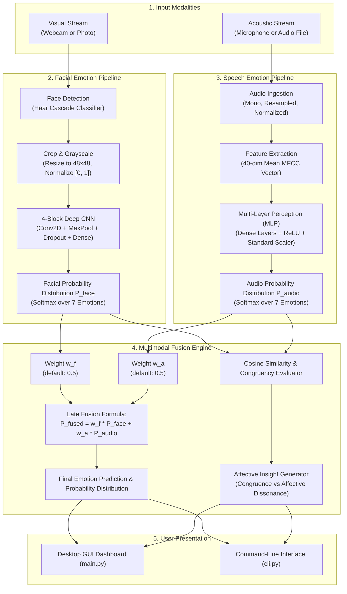

# Multimodal Emotion Recognition System

An integrated, end-to-end affective computing platform combining **Computer Vision (Facial Expression Recognition)** and **Speech Signal Processing (Audio Emotion Recognition)** with **Multimodal Decision-Level Fusion**.

This system unifies and elevates standalone visual and acoustic emotion detection into a unified desktop application and command-line tool.

---

## 📖 Table of Contents
1. [Overview & Features](#-overview--features)
2. [How It Works (Under the Hood)](#-how-it-works-under-the-hood)
   - [1. Visual Facial Modality Pipeline](#1-visual-facial-modality-pipeline)
   - [2. Acoustic Speech Modality Pipeline](#2-acoustic-speech-modality-pipeline)
   - [3. Multimodal Decision-Level Fusion & Congruency Engine](#3-multimodal-decision-level-fusion--congruency-engine)
3. [Universal 7 Emotion Taxonomy](#-universal-7-emotion-taxonomy)
4. [Project Structure](#-project-structure)
5. [Installation & Requirements](#-installation--requirements)
6. [How to Run](#-how-to-run)
   - [A. Desktop Graphical User Interface (GUI)](#a-desktop-graphical-user-interface-gui)
   - [B. Command-Line Interface (CLI)](#b-command-line-interface-cli)
   - [C. Automated Test Suite](#c-automated-test-suite)
   - [D. Re-Training Models](#d-re-training-models)
7. [System Details & Specifications](#-system-details--specifications)
8. [Troubleshooting & FAQs](#-troubleshooting--faqs)
9. [Dataset Credits & Attribution](#-dataset-credits--attribution)

---

## 🌟 Overview & Features

- **Real-Time Facial Emotion Detection**:
  - Detects faces from webcam feeds (30 FPS non-blocking) or static image uploads.
  - Draws color-coded bounding boxes and badges displaying emotion and confidence percentage.
- **Speech Emotion Recognition**:
  - Extracts 40 Mel-Frequency Cepstral Coefficients (MFCCs) from voice recordings.
  - Predicts emotions from `.wav` audio files or 3-second live microphone recordings.
  - Built-in audio playback controls.
- **Multimodal Decision-Level Fusion**:
  - Dynamically combines facial confidence $P_{\text{face}}$ and vocal confidence $P_{\text{audio}}$ with an adjustable weight slider.
  - Identifies **Emotional Congruency** (e.g., both face and voice signal Happiness) vs. **Affective Conflict / Dissonance** (e.g., smiling face with hostile tone, indicating sarcasm or social masking).
- **Session History & CSV Export**:
  - Logs all predictions with timestamps, modalities, and confidence scores. Exportable to CSV.
- **CLI & Automated Testing**:
  - Headless scriptable CLI with optional JSON output, plus a complete unit test suite.

---

## 🧠 How It Works (Under the Hood)



### 1. Visual Facial Modality Pipeline
1. **Face Localization**: Uses OpenCV's Haar Feature-based Cascade Classifier (`haarcascade_frontalface_default.xml`) to identify bounding boxes $(x, y, w, h)$ of all visible faces.
2. **Preprocessing**:
   - Isolates the facial region of interest (ROI).
   - Converts the ROI to grayscale.
   - Resizes to a uniform tensor shape of `(48, 48)`.
   - Normalizes pixel values from $[0, 255]$ to $[0.0, 1.0]$.
3. **Deep CNN Inference**:
   - The tensor is fed into a 4-block Convolutional Neural Network:
     - **Block 1**: Conv2D(32, 3x3) -> Conv2D(64, 3x3) -> MaxPooling2D(2x2) -> Dropout(0.1)
     - **Block 2**: Conv2D(128, 3x3) -> MaxPooling2D(2x2) -> Dropout(0.1)
     - **Block 3**: Conv2D(256, 3x3) -> MaxPooling2D(2x2) -> Dropout(0.1)
     - **Dense Head**: Flatten -> Dense(512, ReLU) -> Dropout(0.2) -> Dense(7, Softmax)
   - Outputs a probability distribution vector across the 7 universal emotion classes.

### 2. Acoustic Speech Modality Pipeline
1. **Audio Ingestion**: Audio waveforms are read as 32-bit floating-point arrays. Multi-channel audio is converted to mono, and amplitude is peak-normalized to prevent clipping.
2. **Acoustic Feature Extraction**:
   - Computes **40 Mel-Frequency Cepstral Coefficients (MFCCs)** across the frequency spectrum using short-time Fourier transforms (STFT) mapped onto the non-linear Mel scale.
   - Computes the temporal mean of each coefficient to capture steady vocal tract resonance and prosodic signatures.
3. **Classifier Forward Pass**:
   - Standardizes the 40-dimensional feature vector using a pre-fitted `StandardScaler`.
   - Passes the features through an optimized Multi-Layer Perceptron (MLP) trained on the Toronto Emotional Speech Set (**TESS**), generating class probabilities across all 7 emotions.

### 3. Multimodal Decision-Level Fusion & Congruency Engine
Human communication relies on both facial expressions and tone of voice. This engine integrates both modalities through **decision-level late fusion**:

1. **Normalized Weighting**:
   $$\bar{w}_f = \frac{w_f}{w_f + w_a}, \quad \bar{w}_a = \frac{w_a}{w_f + w_a}$$
2. **Probability Fusion**:
   $$P_{\text{fused}}(e) = \bar{w}_f \cdot P_{\text{face}}(e) + \bar{w}_a \cdot P_{\text{audio}}(e) \quad \text{for each emotion } e$$
3. **Cross-Modal Congruency Metric**:
   - Computes the vector cosine similarity between the visual distribution $\vec{v}_{\text{face}}$ and acoustic distribution $\vec{v}_{\text{audio}}$:
     $$\text{Similarity} = \frac{\vec{v}_{\text{face}} \cdot \vec{v}_{\text{audio}}}{\|\vec{v}_{\text{face}}\| \|\vec{v}_{\text{audio}}\|}$$
4. **Affective Conflict & Dissonance Detection**:
   - **Congruent (Synergistic Match)**: Facial expression and speech prosody convey the same emotion with high mutual confidence.
   - **Incongruent (Affective Dissonance)**: Facial cues diverge from vocal cues. The system flags psychological phenomena such as:
     - *Smile + Hostile tone*: Sarcasm, forced composure, or passive aggression.
     - *Neutral face + Sad tone*: Suppressed depression or emotional masking.
     - *Angry face + Fearful tone*: Acute high-stress fight-or-flight arousal.

---

## 🎨 Universal 7 Emotion Taxonomy

| Emotion | UI Color Code | Associated Affective Dynamics |
| :--- | :--- | :--- |
| **Angry** | `#E74C3C` (Crimson) | High vocal intensity/pitch, lowered furrowed brows, tightened lips |
| **Disgust** | `#27AE60` (Green) | Lower speech tempo, wrinkled nose, raised upper lip |
| **Fear** | `#8E44AD` (Purple) | Wide eyes, rapid speech cadence, elevated pitch jitter |
| **Happy** | `#F39C12` (Gold) | Raised cheeks (Duchenne smile), melodious vocal inflection |
| **Neutral** | `#7F8C8D` (Slate) | Baseline facial musculature, steady fundamental frequency |
| **Sad** | `#2980B9` (Blue) | Downturned lip corners, reduced vocal power and speech rate |
| **Surprise** | `#E67E22` (Orange) | Widened eyes, dropped jaw, sharp acoustic rise |

---

## 📁 Project Structure

```
facial-audio-emotion-recognition/
├── main.py                    # Primary Desktop GUI application launcher
├── app.py                     # Launcher alias (redirects to main.py)
├── cli.py                     # Command-line interface for terminal/batch scripts
├── requirements.txt           # Verified Python package dependencies
├── test_multimodal.py         # Automated unit and integration test suite
├── README.md                  # Comprehensive documentation
│
├── models/                    # Serialized model weights & cascades
│   ├── haarcascade_frontalface_default.xml   # OpenCV face detection cascade
│   ├── facial_emotion_model.h5               # 4-block CNN for facial emotion
│   ├── audio_emotion_model.joblib            # Trained MLP audio model (99.8% acc)
│   └── audio_label_encoder.json              # Canonical 7 emotion classes
│
├── assets/                    # Graphical & audio resources
│   ├── emojis/                # PNG emoji icons for all 7 emotions
│   ├── banners/               # Visual UI headers and card backgrounds
│   └── samples/               # Preloaded test samples for immediate evaluation
│       ├── audio/             # Test audio files (tess_*.wav for all emotions)
│       └── faces/             # Test facial images for each emotion
│
└── src/                       # Modular source code
    ├── __init__.py
    ├── config.py              # Centralized paths, color palettes, and emotion mappings
    ├── facial_detector.py     # FacialEmotionDetector class (OpenCV + Keras CNN)
    ├── audio_detector.py      # AudioEmotionDetector class (MFCC extraction + inference)
    ├── multimodal_fusion.py   # MultimodalEmotionFusion class (weighted fusion & congruency)
    ├── train_audio.py         # Multi-threaded audio training script
    ├── train_facial.py        # Facial CNN training pipeline
    └── gui.py                 # Modern 5-tab responsive Tkinter GUI
```

---

## 💻 Installation & Requirements

### Prerequisites
- Python 3.10, 3.11, 3.12, or 3.13 (64-bit)
- Working webcam (optional, for live facial video)
- Working microphone (optional, for live voice recording)

### Setup
Install all required libraries via pip:

```bash
cd facial-audio-emotion-recognition
pip install -r requirements.txt
```

*(Packages include: `numpy`, `scipy`, `scikit-learn`, `joblib`, `opencv-python<5.0.0`, `pillow`, `librosa`, `soundfile`, `tensorflow>=2.15.0`, `keras>=3.0.0`, `sounddevice`)*

---

## 🚀 How to Run

### A. Desktop Graphical User Interface (GUI)

Launch the full interactive desktop app using either `main.py` or `app.py`:

```bash
python main.py
```
*(or `python app.py`)*

#### GUI Walkthrough:
1. **Facial Emotion Tab**:
   - Click **Upload Image** to select any photo, or select from the **Sample Faces** dropdown.
   - Click **Start Webcam** to start the live camera feed with real-time bounding boxes and confidence meters. Click **Capture Frame** to take a snapshot for multimodal analysis.
2. **Audio Emotion Tab**:
   - Click **Upload Audio (.wav)** or select a sample from the **Sample Audios** dropdown.
   - Click **Record Mic (3s)** to capture your voice directly from the microphone.
   - Click **Play Audio** to listen to the loaded audio sample.
3. **Multimodal Fusion Tab**:
   - Choose or capture a face input and pick an audio recording.
   - Adjust the **Face vs Voice Weight Slider** (default: 50% / 50%).
   - Click **Analyze Multimodal Fusion** to view the combined emotion, large emoji, congruency status badge, and psychological affective insight.
4. **Prediction History Tab**:
   - Inspect all predictions logged during the session.
   - Click **Export CSV** to save history to a spreadsheet file.
5. **About & System Tab**:
   - Displays real-time model status, environment versions, and dataset citations.

---

### B. Command-Line Interface (CLI)

The CLI supports headless inference, batch scripts, and integration into other applications:

```bash
# 1. Predict Facial Emotion from an Image
python cli.py --face assets/samples/faces/happy_PrivateTest_10077120.jpg

# 2. Predict Audio Emotion from a Speech WAV File
python cli.py --audio assets/samples/audio/tess_happy.wav

# 3. Multimodal Decision Fusion (Synergistic Match)
python cli.py --multimodal --face assets/samples/faces/happy_PrivateTest_10077120.jpg --audio assets/samples/audio/tess_happy.wav

# 4. Multimodal Affective Conflict (Smiling face + Angry tone)
python cli.py --multimodal --face assets/samples/faces/happy_PrivateTest_10077120.jpg --audio assets/samples/audio/tess_angry.wav

# 5. Custom Modality Weights (e.g. 70% Face, 30% Voice)
python cli.py --multimodal --face assets/samples/faces/happy_PrivateTest_10077120.jpg --audio assets/samples/audio/tess_happy.wav --face_weight 0.7 --audio_weight 0.3

# 6. Machine-Readable JSON Output
python cli.py --multimodal --face assets/samples/faces/happy_PrivateTest_10077120.jpg --audio assets/samples/audio/tess_happy.wav --json

# 7. Standalone OpenCV Webcam Window (press 'q' to quit)
python cli.py --webcam
```

---

### C. Automated Test Suite

Run the unit and integration test suite to verify configuration, cascades, model weights, feature extractors, and fusion logic:

```bash
python test_multimodal.py
```

*Expected Result: All 4 test suites pass with status `OK`.*

---

### D. Re-Training Models

#### Retrain the Speech Emotion Model on TESS:
```bash
python src/train_audio.py --n_mfcc 40 --model_type mlp
```
*(Uses multi-threaded parallel extraction across CPU cores and updates `models/audio_emotion_model.joblib`)*

#### Retrain the Facial Emotion CNN on FER Data:
```bash
python src/train_facial.py --data_dir data --epochs 30 --batch_size 32
```
*(Trains the 4-block CNN on grayscale face crops and saves `models/facial_emotion_model.h5`)*

---

## 📊 System Details & Specifications

| Component | Specification |
| :--- | :--- |
| **Facial Model** | 4-block CNN (Conv2D 32 -> 64 -> 128 -> 256 -> Dense 512 -> Softmax 7) |
| **Facial Input** | 48x48 single-channel normalized grayscale tensor |
| **Face Detector** | OpenCV Haar Cascade (`haarcascade_frontalface_default.xml`) |
| **Audio Model** | Multi-Layer Perceptron (Dense 256 -> Dense 128 -> Softmax 7) |
| **Audio Input** | 40-dimensional Mel-Frequency Cepstral Coefficients (MFCCs) |
| **Audio Sample Rate** | 22,050 Hz (mono) |
| **Supported Image Formats** | `.jpg`, `.jpeg`, `.png`, `.bmp`, `.webp` |
| **Supported Audio Formats** | `.wav` (PCM 16/24/32-bit), `.mp3`, `.ogg`, `.flac` |
| **GUI Framework** | Python Tkinter with `ttk` custom styling |
| **Webcam Refresh Rate** | ~30 FPS non-blocking via `root.after(33)` callback loop |

---

## ❓ Troubleshooting & FAQs

1. **Webcam not opening in GUI?**
   - Ensure no other application (Zoom, Teams, Skype, or browser) is currently using camera index 0.
   - If using an external USB webcam, camera index can be adjusted in `src/gui.py` (`cv2.VideoCapture(0)` to `1`).
2. **Microphone recording fails?**
   - Check Windows microphone privacy settings: Settings > Privacy & Security > Microphone > Allow desktop apps to access your microphone.
3. **No audio sound during playback?**
   - Built-in playback uses Windows native `winsound` for zero-dependency WAV playback. Ensure system volume is not muted.
4. **OpenCV version compatibility**:
   - Use `opencv-python<5.0.0` (such as `4.10.x` or `4.14.x`) as specified in `requirements.txt` to ensure `CascadeClassifier` is available.

---

## 📚 Dataset Credits & Attribution

- **Toronto Emotional Speech Set (TESS)**: Created by Kate Dupuis and M. Kathleen Pichora-Fuller at the University of Toronto Psychology Department.
- **Facial Expression Recognition (FER-2013)**: Curated by Pierre-Luc Carrier and Aaron Courville for the ICML 2013 Representation Learning workshop.
