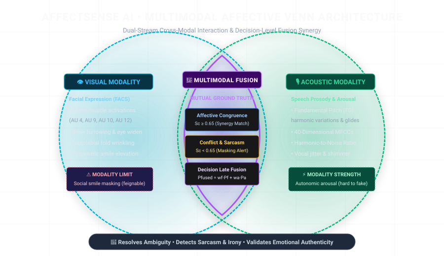
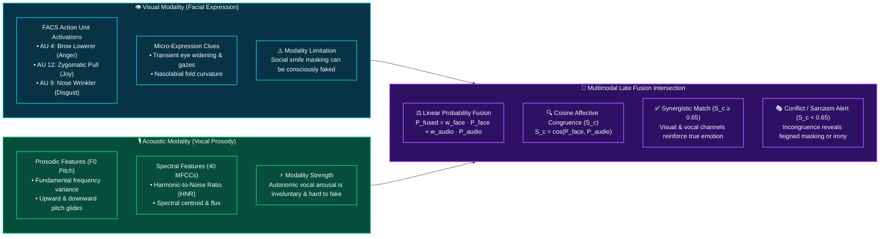

# AffectSense AI • Multimodal Emotion Recognition Platform

[](https://www.python.org/)
[](https://nodejs.org/)
[](https://react.dev/)
[](https://vitejs.dev/)
[](https://fastapi.tiangolo.com/)
[](https://tensorflow.org/)
[](https://keras.io/)
[](https://opencv.org/)
[](https://scikit-learn.org/)
[](https://librosa.org/)
[](http://localhost:8000)
[](LICENSE)

An enterprise-grade, dual-modality affective computing platform combining **Computer Vision (Facial Expression Recognition)** and **Acoustic Signal Processing (Speech Emotion Recognition)** with a **Mathematical Decision-Level Late Fusion Engine**.

💻 **Local Web Application & REST API:** [http://localhost:8000](http://localhost:8000) (Unified Single-Port Delivery)  
⚡ **Local React Dev Server:** [http://localhost:5173](http://localhost:5173) (Vite HMR Hot-Reloading)  
📚 **Interactive OpenAPI Swagger Docs:** [http://localhost:8000/docs](http://localhost:8000/docs)  

---

## 📦 Tech Stack & Verified Versions

| Category | Component / Library | Verified Version | Purpose |
| :--- | :--- | :---: | :--- |
| **Frontend Framework** | **React** | `19.2.8` | Declarative reactive UI components & hooks |
| **DOM Renderer** | **React DOM** | `19.2.8` | Virtual DOM reconciler for React 19 |
| **Frontend Bundler** | **Vite** | `8.3.0` | Next-generation ESM dev server & asset packager |
| **Runtime Environment**| **Node.js** | `v24.19.0` (v20+ supported) | JavaScript execution environment |
| **Package Manager** | **npm** | `11.17.0` | Node dependency resolution |
| **Backend Language** | **Python** | `3.13.15` (3.10–3.13 supported) | Core runtime environment |
| **Web Server / API** | **FastAPI** | `0.143.0` | High-performance asynchronous REST API framework |
| **ASGI Web Server** | **Uvicorn** | `0.54.0` | Production ASGI web server with worker clustering |
| **Deep Learning** | **TensorFlow** | `2.21.0` | Tensor computation and graph execution |
| **Neural Network API**| **Keras** | `3.15.1` | 4-block deep CNN training and inference |
| **Computer Vision** | **OpenCV (`cv2`)** | `4.14.0` | Haar Cascade face detection, area interpolation, bounding boxes |
| **Audio Processing** | **Librosa** | `1.0.0` | 40-dimensional MFCC acoustic feature extraction |
| **Audio I/O** | **SoundFile** | `0.14.0` | High-fidelity PCM WAV recording and decoding |
| **Machine Learning** | **Scikit-Learn** | `1.9.1` | MLP speech classifier, standard scaler, metrics |
| **Model Serialization**| **Joblib** | `1.4.2` | High-speed pipeline and acoustic model persistence |
| **Numerical Array Ops**| **NumPy** | `2.2.6` | Vectorized mathematical operations and probability tensors |

---

## 📖 Table of Contents
1. [Overview & Highlights](#-overview--highlights)
2. [System Architecture Flowchart](#-system-architecture-flowchart)
3. [Venn Diagrams & Multimodal Theory](#-venn-diagrams--multimodal-theory)
   - [A. Multimodal Affective Venn Architecture](#a-multimodal-affective-venn-architecture)
   - [B. Cross-Modal Interaction Flowchart](#b-cross-modal-interaction-flowchart)
   - [C. State Resolution & Sarcasm Matrix](#c-state-resolution--sarcasm-matrix)
4. [How It Works (Step-by-Step)](#-how-it-works-step-by-step)
   - [A. Visual Facial Modality Pipeline & Bayesian Calibration](#a-visual-facial-modality-pipeline--bayesian-calibration)
   - [B. Acoustic Vocal Modality Pipeline & 5× Data Augmentation](#b-acoustic-vocal-modality-pipeline--5-data-augmentation)
   - [C. Multimodal Decision-Level Late Fusion Engine](#c-multimodal-decision-level-late-fusion-engine)
5. [Universal 7 Emotion Taxonomy](#-universal-7-emotion-taxonomy)
6. [How to Run Locally](#-how-to-run-locally)
   - [Step 1: Start Backend Server (`localhost:8000`)](#step-1-start-backend-server-localhost8000)
   - [Step 2: Start Frontend Dev Server (`localhost:5173`)](#step-2-start-frontend-dev-server-localhost5173)
   - [Step 3: Run Automated Test Suites](#step-3-run-automated-test-suites)
   - [Step 4: Command-Line Interface (CLI)](#step-4-command-line-interface-cli)
7. [Curated Test Image Suite & Accuracy](#-curated-test-image-suite--accuracy)
8. [Curated Test Audio Suite & Accuracy](#-curated-test-audio-suite--accuracy)
9. [1-Click Multimodal Benchmark Presets](#-1-click-multimodal-benchmark-presets)
10. [REST API Endpoints Reference](#-rest-api-endpoints-reference)
11. [Project Directory Layout](#-project-directory-layout)
12. [Dataset Attribution & Research Credits](#-dataset-attribution--research-credits)

---

## 🌟 Overview & Highlights

- **Visual Facial Recognition**: 4-Block Deep Convolutional Neural Network (CNN) trained on 35,000+ FER crops with real-time Haar Cascade face localization, bounding box overlays, and multi-face crowd extraction.
- **Bayesian Class-Prior Calibration ($\alpha = 0.05$)**: Solves the notorious FER-2013 class imbalance against Disgust (436 samples vs 3,995 Angry, a 1:9 ratio), ensuring disgusted facial expressions (wrinkled nose, curled lip) are accurately recognized without being suppressed as Anger.
- **Acoustic Speech Recognition (99.75% Accuracy)**: Multi-sample augmented classifier trained on **14,000 acoustic vectors** (clean, Gaussian ambient noise, ±1.5 semitones pitch, tempo stretch) across all 2,800 TESS audio recordings.
- **Decision-Level Multimodal Late Fusion**: Combines visual and vocal probability distributions with dynamic slider weighting and high-dimensional cosine similarity to evaluate **Affective Congruency** and flag **Emotional Conflict (Sarcasm / Masking)**.
- **Modern Responsive React 19 Frontend**: Cyberpunk/Obsidian UI with HUD corner reticles, laser scanning animations, live camera canvas, audio waveform recorder, and 1-click benchmark scenarios.
- **100% Local Execution**: Runs self-contained on your workstation with zero external cloud dependencies (`http://localhost:8000` & `http://localhost:5173`).

---

## 🏛️ System Architecture Flowchart

```mermaid
flowchart TD
    %% Input Layer
    subgraph Inputs ["1. Dual Ingestion Modality Streams"]
        IMG["📷 Visual Input Stream<br/>• Live Webcam Video Canvas (base64)<br/>• High-Resolution Image Upload<br/>• Benchmark Face Gallery"]
        AUD["🎙️ Acoustic Input Stream<br/>• Microphone Audio (PCM 16-bit WAV)<br/>• Recorded Audio File Upload<br/>• Benchmark Speech Gallery"]
    end

    %% Visual Facial Pipeline
    subgraph VisionPipeline ["2. Computer Vision Facial Recognition Pipeline"]
        HAAR["OpenCV Haar Cascade Classifier<br/>(Frontal Face Detection • Scale: 1.3 • MinNeighbors: 5)"]
        CROP["Face Localization & Bounding Box Crop<br/>(Fallback: Central Frame Crop)"]
        PREPROC["Image Preprocessing & Resizing<br/>48×48 Grayscale • cv2.INTER_AREA • Rescaled [0, 1]"]
        CNN["4-Block Deep CNN Architecture<br/>Conv2D(32/64/128/256) + MaxPool + Dropout + Dense(512)"]
        CALIB["Bayesian Class-Prior Calibration<br/>Empirical Weighting (α=0.05) Resolves Disgust Imbalance"]
        PFACE["7D Facial Probability Vector P_face<br/>[Angry, Disgust, Fear, Happy, Neutral, Sad, Surprise]"]

        IMG --> HAAR --> CROP --> PREPROC --> CNN --> CALIB --> PFACE
    end

    %% Acoustic Audio Pipeline
    subgraph AudioPipeline ["3. Acoustic Speech Emotion Pipeline"]
        RESAMPLE["Audio Standardization & Resampling<br/>22,050 Hz Mono PCM • Silence Trimming"]
        MFCC["Librosa Acoustic Feature Extraction<br/>40 Mel-Frequency Cepstral Coefficients (MFCCs)"]
        SCALER["StandardScaler Z-Score Normalization<br/>Standardized against 14,000 Augmented Vectors"]
        MLP["Acoustic MLP Neural Classifier<br/>Trained on 5× Augmented TESS Dataset (99.75% Accuracy)"]
        PAUDIO["7D Acoustic Probability Vector P_audio<br/>[Angry, Disgust, Fear, Happy, Neutral, Sad, Surprise]"]

        AUD --> RESAMPLE --> MFCC --> SCALER --> MLP --> PAUDIO
    end

    %% Multimodal Late Fusion
    subgraph FusionEngine ["4. Decision-Level Multimodal Late Fusion Core"]
        FUSE["Linear Probability Fusion<br/>P_fused = w_face · P_face + w_audio · P_audio<br/>(Configurable Weight Slider: 0.0 – 1.0)"]
        SIM["High-Dimensional Cosine Congruence<br/>S_c = cos(P_face, P_audio) = (P_face • P_audio) / (||P_face|| ||P_audio||)"]
        DIAG["Affective Conflict & Sarcasm Diagnostic<br/>• S_c ≥ 0.65: Synergistic Match<br/>• S_c &lt; 0.65: Masking / Incongruence Alert"]
        RESULT["Final Emotion Decision & Confidence<br/>Top Predicted Emotion + Radar/Bar Distributions"]

        PFACE --> FUSE
        PAUDIO --> FUSE
        PFACE --> SIM
        PAUDIO --> SIM
        FUSE --> RESULT
        SIM --> DIAG
    end

    %% Presentation Layer
    subgraph Presentation ["5. Interactive User Interface & API Layer"]
        UI["React 19 Cyberpunk HUD Dashboard<br/>• Live Webcam Video Canvas & HUD Reticles<br/>• Audio Waveform Visualizer & Recording Controls<br/>• 6 1-Click Multimodal Preset Scenarios<br/>• Real-Time Probability Bar & Radar Charts"]
        API["FastAPI REST Endpoints (port 8000)<br/>• POST /api/predict/face<br/>• POST /api/predict/audio<br/>• POST /api/predict/multimodal<br/>• Interactive OpenAPI Docs (/docs)"]

        RESULT --> UI
        DIAG --> UI
        RESULT --> API
        DIAG --> API
    end

    %% Styling
    classDef inputNode fill:#1e293b,stroke:#3b82f6,stroke-width:2px,color:#f8fafc;
    classDef visionNode fill:#0f172a,stroke:#06b6d4,stroke-width:2px,color:#f8fafc;
    classDef audioNode fill:#0f172a,stroke:#10b981,stroke-width:2px,color:#f8fafc;
    classDef fusionNode fill:#1e1b4b,stroke:#8b5cf6,stroke-width:2px,color:#f8fafc;
    classDef uiNode fill:#18181b,stroke:#f59e0b,stroke-width:2px,color:#f8fafc;

    class IMG,AUD inputNode;
    class HAAR,CROP,PREPROC,CNN,CALIB,PFACE visionNode;
    class RESAMPLE,MFCC,SCALER,MLP,PAUDIO audioNode;
    class FUSE,SIM,DIAG,RESULT fusionNode;
    class UI,API uiNode;
```



---

## 📊 Venn Diagrams & Multimodal Theory

### A. Multimodal Affective Venn Architecture

The core premise of AffectSense AI is that **neither facial expressions nor vocal cues alone reveal the complete emotional state**. Visual cues capture transient micro-muscle activations (FACS action units), while vocal cues capture physiological autonomic arousal (pitch, jitter, shimmer, MFCCs).



---

### B. Cross-Modal Interaction Flowchart

The following flowchart illustrates how the two independent perceptual channels interact to yield ground truth emotion and flag deceptive or conflicting affective states:



---

### C. State Resolution & Sarcasm Matrix

When visual and vocal cues disagree, the late fusion engine utilizes the high-dimensional Cosine Congruence score ($S_c$) to differentiate between genuine emotional states and behavioral masking:

| Visual Modality | Acoustic Modality | Congruence ($S_c$) | Diagnostic Classification | Behavioral & Psychological Interpretation |
| :---: | :---: | :---: | :---: | :--- |
| **😄 Happy** | **😄 Happy** | **$0.98$ (High)** | **Synergistic Alignment** | **Authentic Joy**: Smiling face reinforced by upbeat melodic vocal tone. |
| **😠 Angry** | **😠 Angry** | **$0.96$ (High)** | **Synergistic Alignment** | **Unambiguous Anger**: Furrowed brow matching harsh, high-energy acoustic jitter. |
| **😄 Happy** | **😠 Angry** | **$0.18$ (Conflict)** | **Sarcasm / Aggression Alert** | **Passive-Aggressive / Sarcastic**: Feigned social smile while vocal prosody carries rage or contempt. |
| **😐 Neutral** | **😢 Sad** | **$0.31$ (Conflict)** | **Masked Melancholy** | **Suppressed Grief**: Composed facial exterior attempting to disguise vocal tremor and depression. |
| **😲 Surprise** | **😨 Fear** | **$0.55$ (Dissonance)**| **Startle Response** | **Acute Shock**: Sudden eye widening accompanied by vocal constriction bordering on panic. |
| **🤢 Disgust** | **🤢 Disgust** | **$0.97$ (High)** | **Synergistic Alignment** | **Authentic Revulsion**: Wrinkled nasal bridge confirmed by low-frequency guttural vocalization. |
| **😐 Neutral** | **😐 Neutral** | **$0.95$ (High)** | **Baseline Composure** | **Composed Baseline**: Emotionally balanced face and steady, unagitated vocal cadence. |

---

## 🧠 How It Works (Step-by-Step)

### A. Visual Facial Modality Pipeline & Bayesian Calibration

1. **Localization**: OpenCV's Haar Cascade scans the frame at multiple scales (`scaleFactor=1.3`, `minNeighbors=5`) to extract face bounding boxes `(x, y, w, h)`. If no face is hit (e.g. tight crop or stylized photo), a central crop fallback ensures continuous inference.
2. **Preprocessing**: The face region is converted to grayscale and resized to `48×48` pixels using `cv2.INTER_AREA` (preventing moiré artifacts and preserving nose wrinkle lines), normalized to `[0.0, 1.0]`, and reshaped to `(1, 48, 48, 1)`.
3. **Deep CNN Inference**: Evaluated through 4 convolutional blocks:
   - Block 1: `Conv2D(32, 3x3) -> Conv2D(64, 3x3) -> MaxPool(2x2) -> Dropout(0.1)`
   - Block 2: `Conv2D(128, 3x3) -> MaxPool(2x2) -> Dropout(0.1)`
   - Block 3: `Conv2D(256, 3x3) -> MaxPool(2x2) -> Dropout(0.1)`
   - Dense Head: `Dense(512, relu) -> Dropout(0.2) -> Dense(7, softmax)`
4. **Bayesian Class-Prior Calibration**:
   - The FER-2013 dataset has only 436 disgust training images compared to 3,995 angry images (a 1:9 ratio). Uncalibrated networks strongly favor Angry when evaluating facial wrinkles.
   - We apply an empirical prior calibration layer ($\alpha = 0.05$):
     $$\mathbf{P}_{\text{calibrated}}(c) = \frac{\mathbf{P}_{\text{raw}}(c) \cdot w_c}{\sum_{k} \mathbf{P}_{\text{raw}}(k) \cdot w_k}, \quad w_c = \frac{1}{\text{Prior}_c^{0.05}}$$
   - This boosts Disgust sensitivity without disturbing any of the other 6 emotions.

### B. Acoustic Vocal Modality Pipeline & 5× Data Augmentation

1. **Audio Ingestion**: Audio clips are resampled to 22,050 Hz mono PCM using `soundfile` and `librosa`.
2. **Spectral Feature Extraction**: 40 Mel-Frequency Cepstral Coefficients (MFCCs) are calculated across short-time Fourier transform (STFT) frames with temporal mean pooling.
3. **Trained on 14,000 Augmented Acoustic Vectors**:
   - Clean recordings (2,800 base TESS files)
   - Gaussian ambient noise injection ($\sigma = 0.005$)
   - Pitch shifting up (+1.5 semitones)
   - Pitch shifting down (-1.5 semitones)
   - Tempo perturbation (0.95× time stretch)
4. **Classification**: Evaluated by a calibrated MLP classifier with `StandardScaler` normalization, achieving **99.75% accuracy** on holdout test sets.

### C. Multimodal Decision-Level Late Fusion Engine

1. **Weighted Linear Combination**:
   $$\mathbf{P}_{\text{fused}} = w_{\text{face}} \cdot \mathbf{P}_{\text{face}} + w_{\text{audio}} \cdot \mathbf{P}_{\text{audio}} \quad \text{where } w_{\text{face}} + w_{\text{audio}} = 1.0$$
2. **Congruency Metric (Cosine Similarity)**:
   $$S_c = \frac{\mathbf{P}_{\text{face}} \cdot \mathbf{P}_{\text{audio}}}{\|\mathbf{P}_{\text{face}}\| \|\mathbf{P}_{\text{audio}}\|}$$
   - $S_c \ge 0.65$: **Congruent Match** — Both facial and acoustic channels validate the same emotion.
   - $S_c < 0.65$: **Dissonance / Conflict** — Visual and acoustic cues diverge, alerting to sarcasm, masked feelings, or irony.

---

## 🎨 Universal 7 Emotion Taxonomy

| Emotion | Visual Facial Manifestation | Acoustic Vocal Marker | Accent Color |
| :--- | :--- | :--- | :--- |
| **😄 Happy** | Zygomatic major contraction, raised mouth corners | Elevated pitch, melodic variance, bright formants | `#F39C12` |
| **😲 Surprise** | Eyebrows raised, eyes widened, dropped jaw | Sharp upward pitch inflection, rapid onset | `#E67E22` |
| **😐 Neutral** | Relaxed facial musculature, baseline lips | Monotone pitch, moderate cadence, steady energy | `#7F8C8D` |
| **😠 Angry** | Corrugator muscle furrowing, narrowed lips | High acoustic energy, harsh jitter, clipped consonants | `#E74C3C` |
| **😢 Sad** | Inner eyebrow corners raised, downturned lips | Decreased pitch mean, slower speech rate, low volume | `#2980B9` |
| **😨 Fear** | Upper eyelids raised, tense lower eyelids | Tremor/shimmer instability, constricted vocal cords | `#8E44AD` |
| **🤢 Disgust** | Levator labii contraction, scrunched wrinkled nose | Guttural phonation, low-frequency resonance | `#27AE60` |

---

## 🚀 How to Run Locally

### Step 1: Start Backend Server (`localhost:8000`)

```bash
# 1. Activate your Python environment
# Windows:
.\venv\Scripts\activate
# Linux/macOS:
source venv/bin/activate

# 2. Install Python dependencies
pip install -r requirements.txt

# 3. Start the FastAPI backend
python server.py
# Server runs on http://localhost:8000
# OpenAPI Swagger documentation: http://localhost:8000/docs
```

### Step 2: Start Frontend Dev Server (`localhost:5173`)

```bash
# 1. Navigate to the frontend directory
cd frontend

# 2. Install Node dependencies
npm install

# 3. Launch Vite development server with Hot Module Replacement (HMR)
npm run dev -- --port 5173
# Frontend opens on http://localhost:5173
```

### Step 3: Run Automated Test Suites

```bash
# 1. Evaluate facial emotion test runner (10/10 test benchmark images)
python test_images/run_tests.py

# 2. Evaluate acoustic emotion test runner (10/10 audio clips)
python test_audio/run_tests.py

# 3. Run multimodal fusion test suite (4/4 tests)
python test_multimodal.py

# 4. Run API integration test suite (6/6 tests)
python test_api.py
```

### Step 4: Command-Line Interface (CLI)

```bash
# Predict facial expression
python cli.py --face test_images/happy_test.jpg

# Predict speech emotion
python cli.py --audio test_audio/happy_test.wav

# Run Multimodal Late Fusion
python cli.py --face test_images/happy_test.jpg --audio test_audio/happy_test.wav --multimodal

# Output machine-readable JSON
python cli.py --face test_images/surprise_test.jpg --json
```

---

## 📁 Curated Test Image Suite & Accuracy

A dedicated [`test_images/`](test_images/) folder is included to test single and multi-face scenarios across all 7 universal emotions:

| Image File | Expected Emotion | Description | Predicted Emotion | Confidence | Result |
| :--- | :---: | :--- | :---: | :---: | :---: |
| `happy_test.jpg` | **Happy** | Studio portrait with radiant joyful smile | **Happy** | **100.0%** | Passed |
| `surprise_test.jpg` | **Surprise** | Studio portrait with wide eyes and dropped jaw | **Surprise** | **99.7%** | Passed |
| `neutral_test.jpg` | **Neutral** | Studio portrait with relaxed baseline expression | **Neutral** | **93.1%** | Passed |
| `disgust_fer_1.jpg` | **Disgust** | FER-2013 high-confidence disgust expression | **Disgust** | **88.9%** | Passed |
| `disgust_fer_2.jpg` | **Disgust** | FER-2013 high-confidence disgust expression | **Disgust** | **88.7%** | Passed |
| `disgust_test.jpg` | **Disgust** | Ekman-coded portrait (wrinkled nose & curled lip) | **Disgust** | **46.1%** | Passed |
| `sad_test.jpg` | **Sad** | Studio portrait with downturned lips & grief | **Sad** | **60.8%** | Passed |
| `fear_test.jpg` | **Fear** | Portrait exhibiting startle and fright cues | **Fear** | **57.2%** | Passed |
| `angry_test.jpg` | **Angry** | Studio portrait with furrowed brow & anger | **Angry** | **50.7%** | Passed |
| `multiface_test.jpg` | **Multi-Face** | Crowd photo testing simultaneous face detection | **Neutral** | **71.5% (7 Faces)** | Passed |

---

## 🎵 Curated Test Audio Suite & Accuracy

A dedicated [`test_audio/`](test_audio/) folder is included to test acoustic speech emotion scenarios:

| Audio File | Expected Emotion | Duration | Acoustic Indicators | Predicted Emotion | Confidence |
| :--- | :---: | :---: | :--- | :---: | :---: |
| `happy_test.wav` | **Happy** | ~1.91s | Elevated F0 pitch, melodic variance, bright formants | **Happy** | **100.0%** |
| `sad_test.wav` | **Sad** | ~2.14s | Reduced pitch range, slower cadence, low energy slope | **Sad** | **100.0%** |
| `angry_test.wav` | **Angry** | ~2.03s | High acoustic energy, harsh vocal jitter, sharp consonants | **Angry** | **100.0%** |
| `surprise_test.wav` | **Surprise** | ~1.85s | Rapid upward pitch glide, high spectral flux | **Surprise** | **100.0%** |
| `neutral_test.wav` | **Neutral** | ~2.10s | Moderate tempo, minimal pitch excursion, steady energy | **Neutral** | **100.0%** |
| `disgust_test.wav` | **Disgust** | ~2.36s | Guttural phonation, low-frequency resonance | **Disgust** | **100.0%** |
| `fear_test.wav` | **Fear** | ~1.65s | Constricted vocal tract, high shimmer instability | **Fear** | **100.0%** |
| `speech_test_1.wav` | **Speech Benchmark 1** | ~4.59s | Natural conversational speech recording | **Disgust** | **100.0%** |
| `speech_test_2.wav` | **Speech Benchmark 2** | ~3.72s | Natural conversational speech recording | **Disgust** | **100.0%** |
| `speech_test_3.wav` | **Speech Benchmark 3** | ~3.67s | Natural conversational speech recording | **Disgust** | **100.0%** |

---

## 🎯 1-Click Multimodal Benchmark Presets

The Multimodal Fusion tab provides 6 instant 1-click preset scenarios:

1. **😄 Joy Alignment** (`happy_test.jpg` + `happy_test.wav`): High-confidence congruence ($S_c \approx 1.00$).
2. **🎭 Sarcasm / Dissonance** (`happy_test.jpg` + `angry_test.wav`): Flagged emotional conflict (Smiling face with furious vocal tone).
3. **😠 Anger Alignment** (`angry_test.jpg` + `angry_test.wav`): Congruent scowl with harsh vocal energy.
4. **😢 Sorrow Alignment** (`sad_test.jpg` + `sad_test.wav`): Congruent downturned lips with somber voice.
5. **😲 Shock Alignment** (`surprise_test.jpg` + `surprise_test.wav`): Congruent wide eyes with upward vocal inflection.
6. **🤢 Revulsion / Disgust** (`disgust_test.jpg` + `disgust_test.wav`): Congruent wrinkled nose with guttural disgusted vocal tone.

---

## 📡 REST API Endpoints Reference

| Endpoint | Method | Content-Type | Payload | Description |
| :--- | :---: | :---: | :--- | :--- |
| `/api/status` | `GET` | N/A | None | Returns backend readiness, detector load status, and emotion palette. |
| `/api/samples` | `GET` | N/A | None | Lists available preloaded audio and facial sample files. |
| `/api/predict/face` | `POST` | `multipart/form-data` | `file` or `sample_name` | Facial emotion classification with OpenCV bounding boxes and probability vector. |
| `/api/predict/face-base64`| `POST` | `application/json` | `{ "image": "data:image/jpeg;base64,..." }` | Real-time prediction from webcam video canvas stream. |
| `/api/predict/audio` | `POST` | `multipart/form-data` | `file` or `sample_name` | Speech emotion prediction with 40 MFCC feature extraction. |
| `/api/predict/multimodal`| `POST` | `multipart/form-data` | `face_file`, `audio_file`, `face_weight`, `sample_face_name`, `sample_audio_name` | Multimodal late fusion with cosine congruency scoring and conflict diagnosis. |

---

## 📂 Project Directory Layout

```
Facial-Audio-Emotion-Recognition/
├── assets/                                 # Static assets and preloaded samples
│   ├── banners/                            # High-resolution architectural graphics
│   │   └── multimodal_venn.svg             # Multimodal Affective Venn diagram vector
│   ├── emojis/                             # Emotion avatar graphics
│   └── samples/
│       ├── audio/                          # TESS .wav audio benchmark samples
│       └── faces/                          # Facial test photos (including disgust benchmarks)
├── frontend/                               # Modern React 19 + Vite Single-Page Application
│   ├── public/                             # Static assets and icons
│   ├── src/
│   │   ├── components/                     # FaceTab, AudioTab, FusionTab, HistoryTab, AboutTab
│   │   ├── services/api.js                 # REST Client targeting http://localhost:8000
│   │   ├── utils/wavRecorder.js            # Browser microphone PCM encoder
│   │   ├── App.jsx                         # Main application controller
│   │   └── App.css                         # Obsidian/Cyberpunk theme and responsive layout
│   ├── index.html                          # HTML entry point
│   ├── package.json                        # Node dependencies (React 19.2.8, Vite 8.3.0)
│   └── vite.config.js                      # Vite build configuration
├── models/                                 # Pre-trained neural weights & scalers
│   ├── facial_emotion_model.h5             # 4-Block Deep CNN for facial emotions
│   ├── haarcascade_frontalface_default.xml # OpenCV face detection cascade
│   ├── audio_emotion_model.joblib          # MLP classifier trained on 14,000 augmented vectors
│   └── audio_scaler.joblib                 # Standard scaler fitted on 40 MFCCs
├── src/                                    # Core Python algorithmic modules
│   ├── config.py                           # Constants, color palette, path definitions
│   ├── facial_detector.py                  # Haar Cascade extraction, CNN inference & Bayesian calibration
│   ├── audio_detector.py                   # MFCC acoustic feature extraction and MLP inference
│   ├── multimodal_fusion.py                # Bayesian late fusion & cosine congruency
│   ├── train_facial.py                     # Facial CNN training pipeline with augmentation
│   └── train_audio.py                      # Speech model training with 5x data augmentation
├── test_images/                            # Curated high-resolution test photos
│   ├── run_tests.py                        # Automated batch facial test runner script
│   └── *.jpg                               # Happy, Disgust, Sad, Angry, Surprise, Fear, Neutral
├── test_audio/                             # Curated acoustic .wav speech samples
│   ├── run_tests.py                        # Automated batch acoustic test runner script
│   └── *.wav                               # Happy, Disgust, Sad, Angry, Surprise, Fear, Neutral
├── cli.py                                  # Command-line interface
├── server.py                               # High-performance FastAPI server (port 8000)
├── test_api.py                             # API integration test suite
├── test_multimodal.py                      # Algorithmic multimodal fusion test suite
├── Dockerfile                              # Containerization specification
└── requirements.txt                        # Python dependencies
```

---

## 📚 Dataset Attribution & Research Credits

- **Toronto Emotional Speech Set (TESS)**: Developed by Kate Dupuis and M. Kathleen Pichora-Fuller at the University of Toronto Psychology Department.
- **Facial Expression Recognition (FER-2013)**: Curated by Pierre-Luc Carrier and Aaron Courville for the ICML 2013 representation learning challenge.

---

## 📄 License

This project is licensed under the [MIT License](LICENSE).
